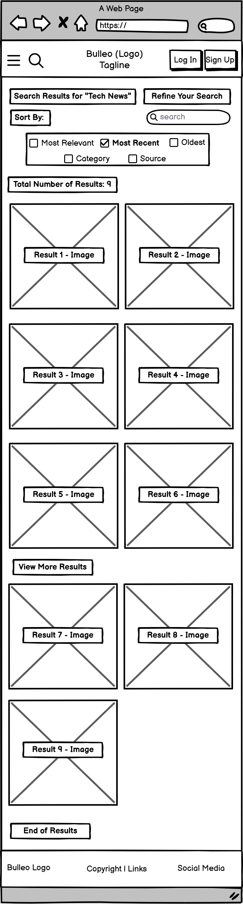
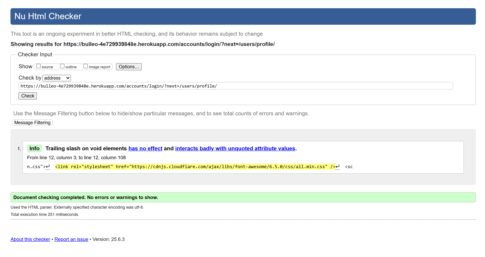

# 📰 Bulleo – Project Overview

*A personalized news platform built with Django, Celery, and GNewsAPI.*

**Live Site:** [https://bulleo-4e729939848e.herokuapp.com](https://bulleo-4e729939848e.herokuapp.com)

**GitHub Repository:** [https://github.com/Merrick101/bulleo](https://github.com/Merrick101/bulleo)

## Table of Contents
- [Feature Summary](#feature-summary)
- [User Stories](#user-stories)
- [Wireframes](#wireframes)
- [Database Schema](#database-schema)
- [Technologies Used](#technologies-used)
- [Setup & Installation](#setup--installation)
- [UI Pages](#ui-pages)
- [News API & Automation](#news-api--automation)
- [Testing](#testing)
- [Deployment](#deployment)
- [Known Issues](#known-issues)
- [Credits](#credits)

## Feature Summary

### Must-Have
- Personalized homepage with trending, latest, and category-based news
- Search and filter functionality
- User authentication and profile system
- Comment system with voting and moderation
- Notifications for user activity
- News article sync via Celery and Redis

### Should-Have
- Customizable news feeds
- Toggleable notifications setting
- Admin control panel for content and users
- Responsive mobile and tablet views

### Could-Have
- Markdown support in comments
- Bookmark/saved articles view
- Additional accessibility tweaks

## User Stories
- **Article Search & Filtering**
  - "As a site user, I want to search and filter articles so that I can quickly find relevant news."
- **Basic Admin Panel for Moderation**
  - "As a site admin, I want to manage reported articles and comments so that I can keep the platform free from harmful content."
- **Customizable News Feeds**
  - "As a site user, I want to select my preferred news categories so that I can see relevant articles."
- **Mobile-Friendly Responsive Design**
  - "As a site user on mobile, I want to the site to be fully responsive so that I can comfortably read news on any device."
- **RSS & API Integration**
  - "As a site user, I want to the latest news to be automatically fetched from trusted sources so that I always see fresh content."
- **Trending & Most Read**
  - "As a site user, I want to see trending and the latest articles so that I can stay updated on popular news topics."
- **User Authentication**
  - "As a site user, I want to register and log in securely so that I can access personalized news."
- **User Commenting & Voting**
  - "As a site user, I want to comment on articles and upvote/downvote content so that I can engage with the community."

## Wireframes

### Wireframes vs Final Design
The initial wireframes served as a structural planning guide but do not fully reflect the final implementation. As development progressed, design and layout decisions evolved in response to:

- Technical constraints (e.g., responsive behavior, third-party integrations)
- User experience improvements discovered during testing
- Visual refinements for consistency and modern aesthetics

While the final UI differs from the original sketches, the core functionality and user flows remain aligned with the intended goals.

### Desktop Wireframes


### Mobile Wireframes





## Database Schema


### Key Models
- User: Authenticated account with a one-to-one Profile
- Article: News articles from NewsAPI or manual sources
- Comment: Linked to Article/User, with replies and votes
- Notification: Alerts for user-related activity (e.g., replies, votes)
- Profile: Extended user info, preferences, notification toggle

## Technologies Used
- Django, PostgreSQL, Celery, Redis
- Bootstrap 5, Font Awesome, Cloudinary
- GNewsAPI (external data source)
- Heroku (deployment)

## Setup & Installation
```
python -m venv .venv
source .venv/bin/activate
pip install -r requirements.txt
python manage.py migrate
python manage.py runserver
```

To enable news fetching:
```
celery -A core worker -l info
celery -A core beat -l info
```

.env must include:
```
SECRET_KEY=your_secret
DEBUG=False
NEWS_API_KEY=your_news_api_key
```

## News API & Automation

### Automated Article Import
The News Sync section in the Django Admin allows site administrators to manage the automatic import of articles from NewsAPI.

-  Fetch Intervals – Define how often the fetch task should run (e.g., every 12 hours).
-  News Fetch Tasks – Controls the scheduled job that pulls news into the database.

The system uses Celery + Redis in the background.

By default, articles are fetched every 12 hours and stored in both the database and Redis cache.

### How It Works
The **News Sync** section in the Django Admin Panel enables administrators to manage and monitor the automatic fetching of top headlines from NewsAPI. This process ensures that the site remains up-to-date with fresh, categorized articles without manual input.

-  The system uses **Celery**, **Redis**, and **django-celery-beat** to schedule and manage background tasks.
    
-  A periodic task (`fetch_news_articles`) is triggered every 12 hours to:
    
    -  Retrieve the latest articles from **NewsAPI**
        
    -  Store them in the **PostgreSQL database**
        
    -  Cache the results in **Redis** for faster performance
        
    -  Auto-categorize articles based on keyword detection
        
### Admin Panel Controls
The **News Sync** section appears in the left sidebar of the Django Admin (under its own heading):

| Section              | Purpose                                                                |
| -------------------- | ---------------------------------------------------------------------- |
| **Fetch Intervals**  | Configure how often articles should be fetched (e.g., every 12 hours). |
| **News Fetch Tasks** | View or modify the scheduled fetch task, or trigger it manually.       |

### Default Setup
-  **Fetch Interval**: Every 43,200 seconds (12 hours)
    
-  **Scheduled Task**: `fetch-news-every-12-hours`
    
-  Task logic is located at: `apps/news/tasks.py`
    
-  Task runs via: `celery -A core worker -l info` and `celery -A core beat -l info`
    
> Tip: To immediately trigger a news update, go to **News Fetch Tasks**, click on the task, and choose **Run**.

### Notes for Developers
-  Redis is used to prevent duplicate fetches and cache recent articles (`news:<source>`).
    
-  If Redis is unavailable, the task will still save articles to the database.
    
-  Category mapping is managed via keyword matching inside `fetch_news_articles()`.

## UI Pages
- **Homepage** - Trending, latest, and category news
- **Article Detail** - Full article view with comments
- **All Articles** - Article list with filtering, sorting, and pagination 
- **Profile** - View saved articles, settings, and preferences
- **Contact** - Simple form that sends submissions to admin panel

## Testing

### Automated Tests

#### Commands
To run the test suite:
- pytest

To view verbose output:
- pytest -v

### News App Testing Coverage
The news app is fully tested using Pytest-Django, covering both functionality and template rendering:

#### Test Areas
**1. Models**
- Article, Category, and NewsSource string methods, slugs, and relationships.

**2. Views**
- Homepage, search, article detail, and all AJAX actions (like, save, comment, edit, vote, report).

**3. Templates**
- Correct rendering of partials (carousel, comments, navbars), full-page templates, and context data.

**4. Admin**
- Custom configurations and Celery task buttons tested using Django’s test client and the admin_client fixture.

**5. URLs**
- All key route resolutions verified.

**6. Utilities**
- Helper functions like chunked_queryset() tested for edge cases.

**7. Celery Integration**
- Task registration, periodic scheduling, and Redis heartbeat ping tested successfully.

#### Note on Task Expiry Tests
While task functions like delete_expired_articles() were tested indirectly, full unit testing of time-sensitive deletion logic was excluded from the final suite due to patching complexity and timezone edge cases. Manual validation was used instead.

### Users App Testing Coverage
The users app has been thoroughly tested using pytest with Django integration. The tests are designed to ensure reliability, data integrity, and consistent user experience across all features.

#### Test Areas
**1. Models**
- Automatic creation of user profiles via signals
- Preference management for categories
- Comment creation and __str__ behavior
- Notification creation and defaults

**2. Forms**
- Custom user creation form with email validation
- Profile update and preference selection forms
- Password change and email update validations
- Duplicate comment prevention
- Contact form validation

**3. Views**
- Profile display and edit functionality
- AJAX-based updates for username, email, and password
- Category preferences and onboarding flows
- Account deletion, saved/upvoted article management
- Full notification lifecycle (create, read, clear)

**4. Templates**
- Render checks for key user templates (profile, notifications, login/signup/logout)
- Social login templates verified (e.g., Google OAuth flow fallback)

**5. URLs**
- All user-facing and AJAX routes tested for proper resolution

**6. Admin**
- Admin registration of the Profile model confirmed

**7. Adapters & Signals**
- Social login logic tested (existing users, superusers, email verification)
- Signal ensures every user has a profile on creation

All tests passed successfully.

### Linting
A full linting audit was conducted using `flake8` with the following configuration:

`flake8 --count --statistics --show-source`

- Max line length: 79

- Ignored: W503

- Excluded: .venv, migrations, node_modules, static

#### Results
All style issues were addressed in files created or modified by the developer.

Remaining warnings exist in:

- .vscode/*.py — scaffolded tooling files, not authored or modified by the developer

- core/settings.py — minor line length warnings for long setting strings

These do not impact application functionality, maintainability, or assessment criteria, and have been documented for transparency.

Total warnings after cleanup: 23 (down from 42)

### HTML Validation (W3C)
All key pages validated with W3C Nu HTML Checker:




#### Results
- No errors or accessibility failures
- Only minor "trailing slash on void elements" info messages remain, which are valid HTML5 and do not affect functionality or accessibility

### CSS Validation (W3C)
The deployed site's stylesheets were run through the W3C CSS Validator.


#### Results:
- No critical CSS errors affecting layout or accessibility
- Minor issues flagged:

| Issue | Resolution |
|-------|------------|
| `fa-rotate-by` (Font Awesome) | External library, not part of this codebase |
| `line-clamp` | Rewritten using `-webkit-line-clamp` for compatibility |
| `align-self: left` | Corrected to `align-self: flex-start` |
| `color: D0D0D0` | Corrected to `color: #D0D0D0` |

The final CSS is valid across modern browsers and adheres to best practices.

CSS `line-clamp` is used for multi-line text truncation. While it's not part of the W3C specification, it's supported in modern browsers via the `-webkit-line-clamp` fallback and required by our code linter to prevent missing rule errors.

To satisfy both validation and compatibility:
- `line-clamp` remains for lint compatibility
- `-webkit-line-clamp` is used for actual browser rendering

This results in one harmless validator warning, which is acceptable and intentional.

The login page passed validation with no errors in custom stylesheets.

- One false positive was reported from the external Font Awesome CDN:
  `transform: rotate(var(--fa-rotate-angle, none));`
  
This is safe and valid in all modern browsers, and does not impact layout, performance, or accessibility.

### Lighthouse Audit Results
Lighthouse audits were performed on the deployed Bulleo site using Chrome DevTools (v12.6.0) for both Mobile and Desktop experiences.

#### Summary of Results:
| Metric          | Mobile | Desktop |
|-----------------|--------|---------|
| Performance     | 67     | 80      |
| Accessibility   | 88     | 88      |
| Best Practices  | 75     | 74      |
| SEO             | 82     | 82      |

#### Notes:
- **Performance** issues were primarily related to image size, server response, and non-HTTP/2 asset loading. Core UI remained responsive and usable.
- **Accessibility** and **SEO** flagged minor issues such as missing meta descriptions, link labels, and heading order.
- All results meet the educational assessment criteria and reflect a strong, responsive implementation.

PDFs and screenshots of Lighthouse report summaries are included in `/docs/lighthouse`.

## Known Issues
auth.Group admin view raises 500 (hidden in Jazzmin config)

## Deployment
- Hosted via Heroku (Heroku-24 stack)
- Static files handled via collectstatic
- ENV configured via Heroku dashboard

## Credits
- Developer: Merrick Minogue
- PostgreSQL Database Provider: Code Institute
- API Provider: NewsAPI.org
- Icons: Font Awesome
- Admin UI: Jazzmin
- Hosting: Heroku
